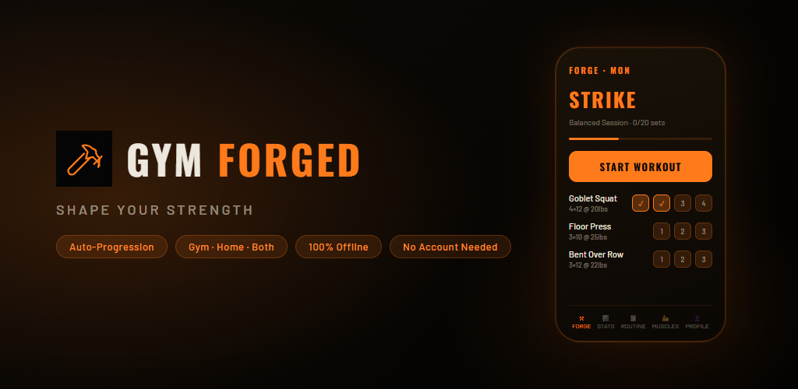
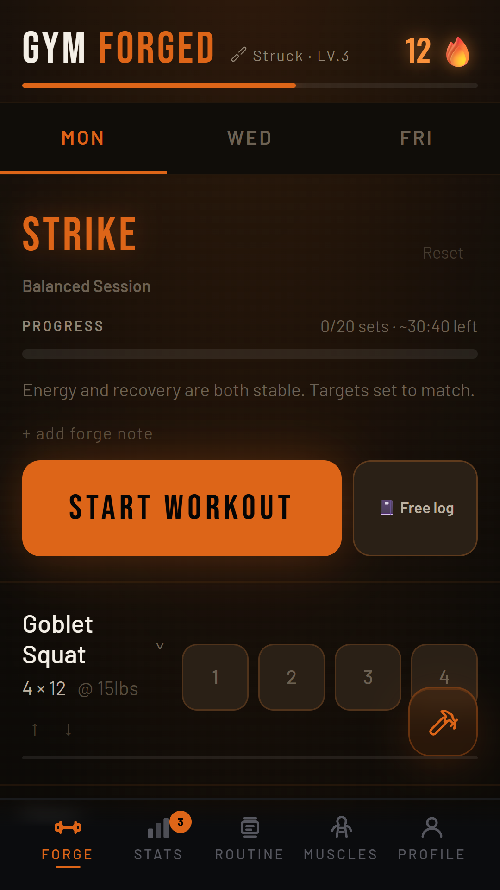
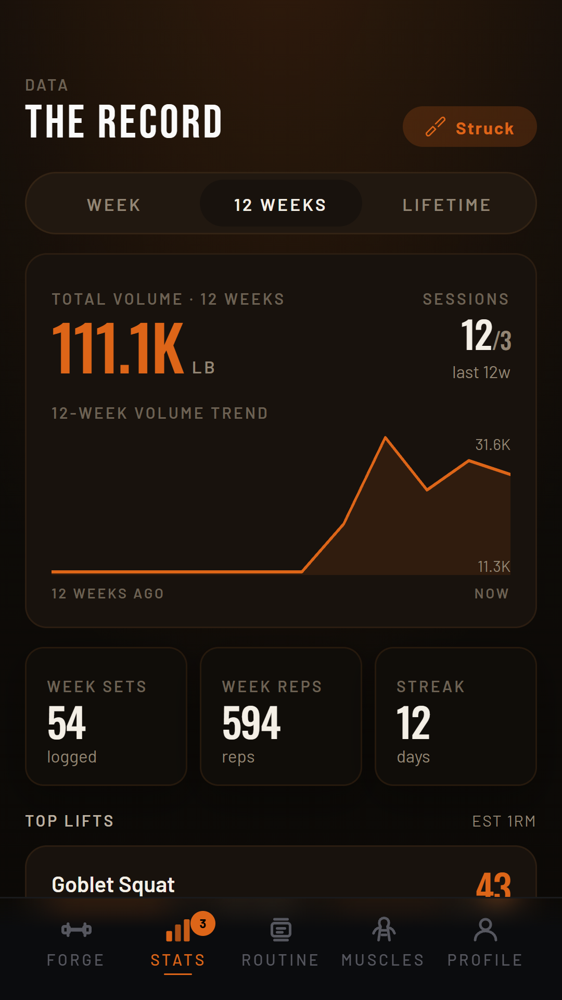
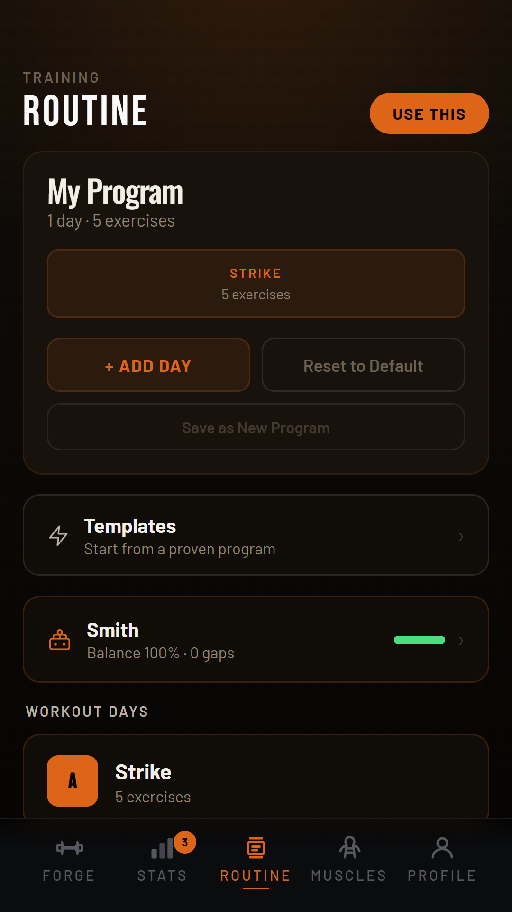
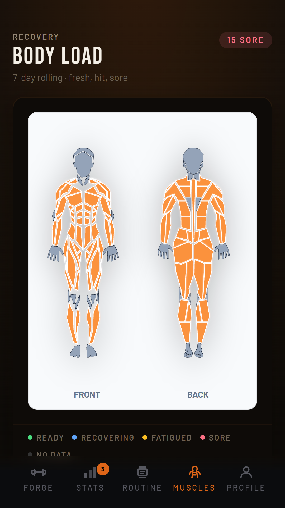
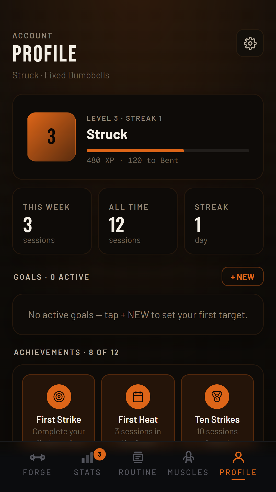

# Gym Forged



Gym Forged is an offline-first workout tracker for dumbbell, gym, and home training. It combines fast set logging with adaptive progression, readiness checks, muscle recovery, goals, and a coach-style routine builder while keeping all workout data on the device.

Built as a Vite + React app, packaged for Android with Capacitor, and installable as a PWA.

## Screenshots

| Workout | Stats | Routine | Muscle Map | Profile |
|---|---|---|---|---|
|  |  |  |  |  |

## What It Does

- Log sets, reps, weight, notes, substitutions, and completed workouts.
- Auto-progress reps, tempo, variations, and load based on performance.
- Adapt sessions using readiness, soreness, sleep, pain, goals, age, equipment, and training history.
- Track stats, streaks, personal records, muscle coverage, achievements, XP, body metrics, and goals.
- Build and edit routines for fixed dumbbells, adjustable dumbbells, barbell, bodyweight, or mixed equipment.
- Export and import a JSON backup for moving or restoring data.

## Privacy And Offline Use

Gym Forged has no accounts, no analytics, no ads, no backend, and no cloud sync. Workout history, profile, settings, goals, and progression data are stored locally in browser or WebView storage on the device.

The app works offline after first load. Fonts and app assets are bundled, and the Android app runs through a Capacitor shell.

## Local Development

```sh
npm install
npm run dev
```

Useful commands:

```sh
npm run lint
npm test
npm run build
npm run size
npm run preview
```

## Android

Sync the web build into the Android project:

```sh
npm run android:sync
```

Open the project in Android Studio:

```sh
npm run android:open
```

Build a debug APK:

```sh
cd android
./gradlew assembleDebug --no-daemon
```

Debug APK output:

```text
android/app/build/outputs/apk/debug/app-debug.apk
```

Install on a connected Android device:

```sh
adb install android/app/build/outputs/apk/debug/app-debug.apk
```

## Quality Checks

Before release, run:

```sh
npm run lint
npm test
npm run build
npm run size
npm run android:sync
```

Then build and install the Android APK on a real device or emulator. The manual release checklist lives in [QA.md](QA.md).

## Project Structure

```text
src/                  React app, views, coach logic, data models
public/               PWA manifest, service worker, public icons
android/              Capacitor Android project
assets/               Capacitor icon and splash source assets
screenshots/          Play Store and README screenshots
scripts/              Build, icon, screenshot, and bundle-size scripts
test/                 Node test suite
```

## Release Notes

See [CHANGELOG.md](CHANGELOG.md) for version history and [PRIVACY.md](PRIVACY.md) for the full privacy policy.
